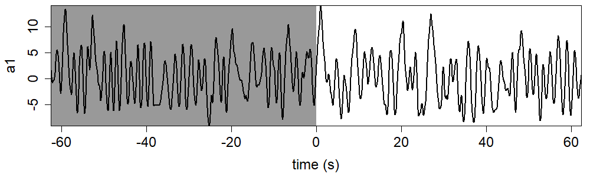
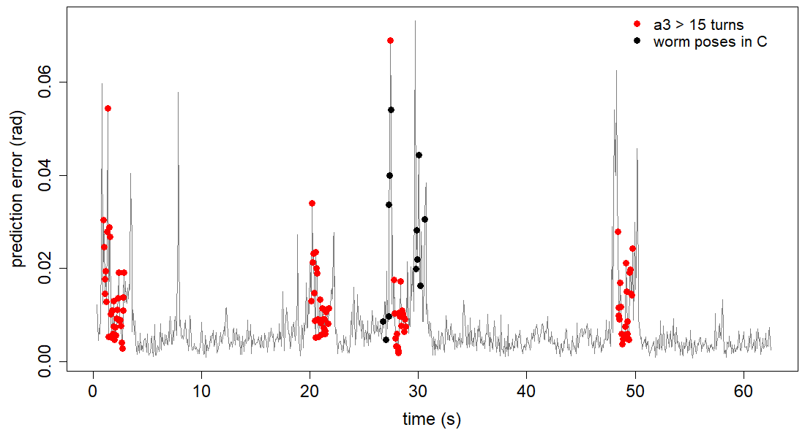
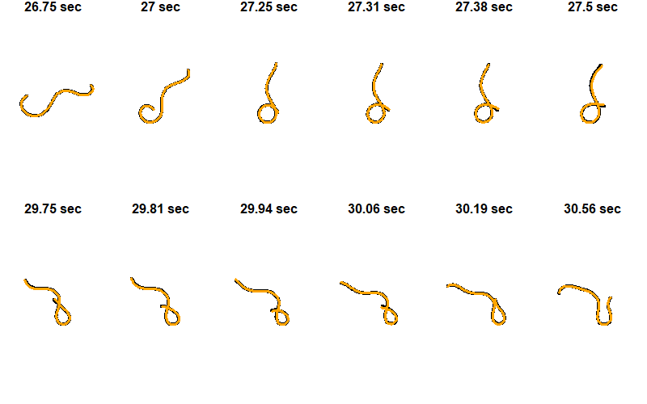

NOTE: Run all the code included on the “Base Code” page prior to running the following.

### Setting Up
Load eigenworms and worm data of choice.
```{r, eval=F, echo=T}
# working directory
setwd("")  # enter appropriate working directory

# load eigenworms [Broekmans et al. 2016]
ew = read.csv("eigenworms.csv", header=F, sep=",") 

# load coefficients from worm of choice
data = read.csv("12 Foraging Worms/1.txt", header=F, sep="")[10001:12000,1:5]
```

### Variables
These are the optimal parameters for the data produced by Broekmans et al. 2016.
```{r, eval=F, echo=T}
E = 5  # embedding dimension
tp = 1
theta = 2  # linearity
tau = 1

# library and prediction selection
lib = c(1,1000)
pred = c(1001,2000)

# convert frames to seconds (i.e. indicate frames per second as fps)
fps = 16  # foraging worms
```

### Run Functions
Run the functions created on the "Base Code" page.
```{r, eval=F, echo=T}
# run the embedding function for separate lib and pred
matrix1 <- make_embed(data[lib[1]:lib[2],], E, tau, tp)
matrix2 <- make_embed(data[pred[1]:pred[2],], E, tau, tp)
matrix = rbind(matrix1, matrix2)

# run the prediction function
new_pred <- make_pred(E, matrix, theta, lib, pred)
observations_total = new_pred$obs
predictions_total = new_pred$pred

# run the EDM error function
errors <- edm_error(pred, observations_total, ew, predictions_total)

# run the cp error function
cp_mean <- cp_error(pred, data, ew)
```

### Coefficient Plot
Create a coefficients vs time plot with the library shown as backwards in time.
```{r, eval=F, echo=T}
# define "ends" of the figure as lengths of lib and pred
left_end = -length(lib[1]:lib[2])
right_end = length(pred[1]:pred[2]) - 1

# pick a coefficient to plot with choice of 1, 2, 3, 4, or 5
co_num = 1
co = data[lib[1]:pred[2], co_num]

# plot assumes that lib and pred are adjacent
par(mai=c(0.95,0.95,0.05,0.05))
plot(c(left_end:right_end)/fps, co, type="l", xlab="time (s)", ylab="a1", cex.lab=1.5,
     cex.axis=1.5, xaxs="i", yaxs="i")
rect(left_end, min(co, na.rm=TRUE), 0, max(co, na.rm=TRUE), col="grey60", border=NA)
lines(c(left_end:right_end)/fps, co, lwd=2)
box(col="black")
```

```{r  out.width = "60%", echo=FALSE}
library(knitr)
library(png)

```

### Error Plot
Create an RMS error vs time plot with red dots indicating a3 > 15 turns.
```{r, eval=F, echo=T}
# identify turns as a3 > 15 points
turns <- which(abs(data[pred[1]:pred[2],3]) > 15)

# choose frames for the worm poses
black_points <- c(428,432,436,437,438,440,476,477,479,481,483,489)

# RMS error with red points on a3 > 15 turns
par(mai=c(0.95,0.95,0.1,0.1))
plot(c(1:length(errors))/fps, errors, type="l", xlab="time (s)", ylab="prediction error (rad)",
     col="grey50", cex.lab=1.5, cex.axis=1.5, lwd=1.5)
points(turns/fps, errors[turns], col="red", pch=19, cex=1.3)
points(black_points/fps, errors[black_points], pch=19, cex=1.3)
abline(h=cp_mean, lty="dashed")  # average cp error

legend("topright", legend=c("a3 > 15 turns", "worm poses in C"), col=c("red", "black"), pch=19,
       box.lty=0, cex=1.3)
box(col="black")
```

```{r  out.width = "60%", echo=FALSE}
library(knitr)
library(png)
 
```

### Worm Pose Plot
Plot the observed and predicted positions of the worm at the frames chosen above.
```{r, eval=F, echo=T}
# create empty vectors for the total observations and predictions
total_obs_x = {}
total_obs_y = {}
total_pred_x = {}
total_pred_y = {}

# loop through all the chosen frames
for (worm in black_points){
  obs_data = observations_total[worm,]
  pred_data = predictions_total[worm,]
  
  # create an empty position array for the observations
  obs_pos = array(0, dim=c(100,1))
  for(i in c(1:5)){
    # multiply eigenworms by coefficients
    obs_pos = obs_pos + ew[,i]*as.numeric(obs_data[i])
  }
  
  # repeat for the predictions
  pred_pos = array(0, dim=c(100,1))
  for(i in c(1:5)){
    # multiply eigenworms by coefficients
    pred_pos = pred_pos + ew[,i]*as.numeric(pred_data[i])
  }
  
  # create x and y coordinates for the observations
  obs_x = {0}
  obs_y = {0}
  for(i in c(2:100)){
    # convert worm angles to xy space
    obs_x = c(obs_x, obs_x[i-1] + cos(obs_pos[i]))
    obs_y = c(obs_y, obs_y[i-1] + sin(obs_pos[i]))
  }
  
  # repeat for the predictions
  pred_x = {0}
  pred_y = {0}
  for(i in c(2:100)){
    # convert worm angles to xy space
    pred_x = c(pred_x, pred_x[i-1] + cos(pred_pos[i]))
    pred_y = c(pred_y, pred_y[i-1] + sin(pred_pos[i]))
  }
  
  # subtract the mean of each
  obs_x = obs_x - mean(obs_x)
  obs_y = obs_y - mean(obs_y)
  pred_x = pred_x - mean(pred_x)
  pred_y = pred_y - mean(pred_y)
  
  # add the observations and predictions to the total
  total_obs_x = c(total_obs_x, obs_x)
  total_obs_y = c(total_obs_y, obs_y)
  total_pred_x = c(total_pred_x, pred_x)
  total_pred_y = c(total_pred_y, pred_y)
}

# calculate the graph limits based on the total
xmag = max(abs(total_obs_x), abs(total_pred_x))
ymag = max(abs(total_obs_y), abs(total_pred_y))

# create a counter for the graphs
i = 1

# loop through all the chosen frames
for (worm in black_points){
  # select the observations and predictions
  obs_x = total_obs_x[((i*100) - 99):(i*100)]
  obs_y = total_obs_y[((i*100) - 99):(i*100)]
  pred_x = total_pred_x[((i*100) - 99):(i*100)]
  pred_y = total_pred_y[((i*100) - 99):(i*100)]
  
  # plot the worm poses for the observed and predicted data
  par(mai=c(0.15,0.15,0.15,0.15))
  plot(obs_x, obs_y, type="l", xlab="", ylab="", main=paste(round(worm/fps, digits=2),"sec"),
       lwd=4, axes=F, cex.main=1.5, xlim=c(-xmag,xmag), ylim=c(-ymag,ymag), asp=1)
  lines(pred_x, pred_y, col="orange", lwd=3)
  
  # increase the counter
  i = i + 1
}
```

```{r  out.width = "60%", echo=FALSE}
library(knitr)
library(png)
 
```
