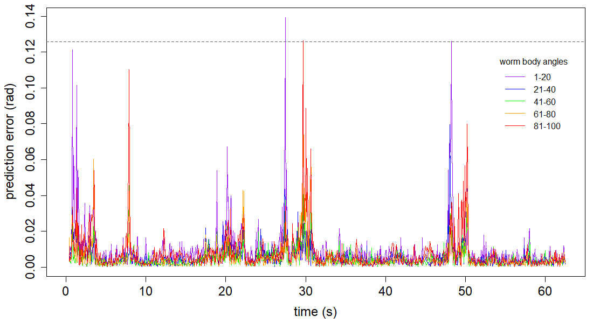

NOTE: Run all the code included on the “Base Code” page prior to running the following.

### Setting Up
Load eigenworms and worm data of choice.
```{r, eval=F, echo=T}
# working directory
setwd("")  # enter appropriate working directory

# load eigenworms [Broekmans et al. 2016]
ew = read.csv("eigenworms.csv", header=F, sep=",") 

# load coefficients from worm of choice
data = read.csv("12 Foraging Worms/1.txt", header=F, sep="")[10001:12000,1:5]
```

### Variables
These are the optimal parameters for the data produced by Broekmans et al. 2016.
```{r, eval=F, echo=T}
E = 5  # embedding dimension
tp = 1
theta = 2  # linearity
tau = 1

# library and prediction selection
lib = c(1,1000)
pred = c(1001,2000)

# convert frames to seconds (i.e. indicate frames per second as fps)
fps = 16  # foraging worms
```

### Run Functions
Run the functions created on the "Base Code" page.
```{r, eval=F, echo=T}
# run the embedding function for separate lib and pred
matrix1 <- make_embed(data[lib[1]:lib[2],], E, tau, tp)
matrix2 <- make_embed(data[pred[1]:pred[2],], E, tau, tp)
matrix = rbind(matrix1, matrix2)

# run the prediction function
new_pred <- make_pred(E, matrix, theta, lib, pred)
observations_total = new_pred$obs
predictions_total = new_pred$pred

# run the EDM error function for sections
errors <- edm_error_section(pred, observations_total, ew, predictions_total)

# run the cp error function
cp_mean <- cp_error(pred, data, ew)
```

### Error Plot
Create an RMS error vs time plot, broken into worm body angle segments.
```{r, eval=F, echo=T}
# RMS error by body segment for all 5 segments
par(mai=c(0.9,0.9,0.15,0.15))
plot(c(1:length(errors[,1]))/fps, errors[,1], col="purple", type="l", xlab="time (s)",
     ylab="prediction error (rad)", cex.lab=1.5, cex.axis=1.5)
lines(c(1:length(errors[,2]))/fps, errors[,2], col="blue")
lines(c(1:length(errors[,3]))/fps, errors[,3], col="green")
lines(c(1:length(errors[,4]))/fps, errors[,4], col="orange")
lines(c(1:length(errors[,5]))/fps, errors[,5], col="red")
abline(h=cp_mean, lty="dashed", col="grey40")  # average cp error

# add a plot legend
legend(53,0.12, title="worm body angles", lty=1, cex=1, bty="n",
       legend=c("1-20", "21-40", "41-60", "61-80", "81-100"),
       col=c("purple", "blue", "green", "orange", "red"))
```

```{r  out.width = "60%", echo=FALSE}
library(knitr)
library(png)
 
```
