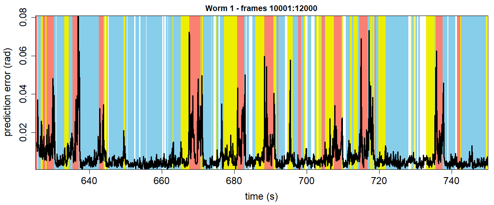

NOTE: Run all the code included on the “Base Code” page prior to running the following.

### Setting Up
Load eigenworms and worm data of choice.
```{r, eval=F, echo=T}
# working directory
setwd("")  # enter appropriate working directory

# load eigenworms [Broekmans et al. 2016]
ew = read.csv("eigenworms.csv", header=F, sep=",") 

# load coefficients from worm of choice and crop the data to specified values
start = 10001
end = 12000
data = read.csv("12 Foraging Worms/1.txt", header=F, sep="")[start:end,1:5]
```

### Variables
These are the optimal parameters for the data produced by Broekmans et al. 2016.
```{r, eval=F, echo=T}
E = 5  # embedding dimension
tp = 1
theta = 2  # linearity
tau = 1

# library and prediction selection
lib = c(1,1000)
pred = c(1,2000)

# convert frames to seconds (i.e. indicate frames per second as fps)
fps = 16  # foraging worms
```

### Run Functions
Run the functions created on the "Base Code" page.
```{r, eval=F, echo=T}
# run the embedding function
matrix <- make_embed(data, E, tau, tp)

# run the prediction function
new_pred <- make_pred(E, matrix, theta, lib, pred)
observations_total = new_pred$obs
predictions_total = new_pred$pred

# run the EDM error function
errors <- edm_error(pred, observations_total, ew, predictions_total)

# run the data classification function
new_class <- data_class(data, pred)
forward = new_class$forw
backward = new_class$back
turns = new_class$turn
change = new_class$chan
```

### Error Plot
Create an RMS error vs time plot with colored classifications.
```{r, eval=F, echo=T}
# setup the RMS error vs time plot
par(mai=c(0.9,0.9,0.4,0.15))
plot(c(start:end)/fps, errors, col="white", xlab="time (s)", ylab="prediction error (rad)",
     cex.lab=1.5, cex.axis=1.5, xaxs="i", yaxs="i", main="Worm 1 - frames 10001:12000")

# add colored rectangles for forwards, backwards, and turns
for (i in 1:length(forward)){
  rect(c(start:end)[forward[i]]/fps, min(errors, na.rm=TRUE),
       c(start:end)[forward[i]+2]/fps, max(errors, na.rm=TRUE),
       col="skyblue", border=NA)
}
for (i in 1:length(backward)){
  rect(c(start:end)[backward[i]]/fps, min(errors, na.rm=TRUE),
       c(start:end)[backward[i]+2]/fps, max(errors, na.rm=TRUE),
       col="yellow2", border=NA)
}
for (i in 1:length(turns)){
  rect(c(start:end)[turns[i]]/fps, min(errors, na.rm=TRUE),
       c(start:end)[turns[i]+2]/fps, max(errors, na.rm=TRUE),
       col="salmon", border=NA)
}

# add the error line on top
lines(c(start:end)/fps, errors, lwd=3)
box(col="black")
```

```{r  out.width = "60%", echo=FALSE}
library(knitr)
library(png)
 
```
